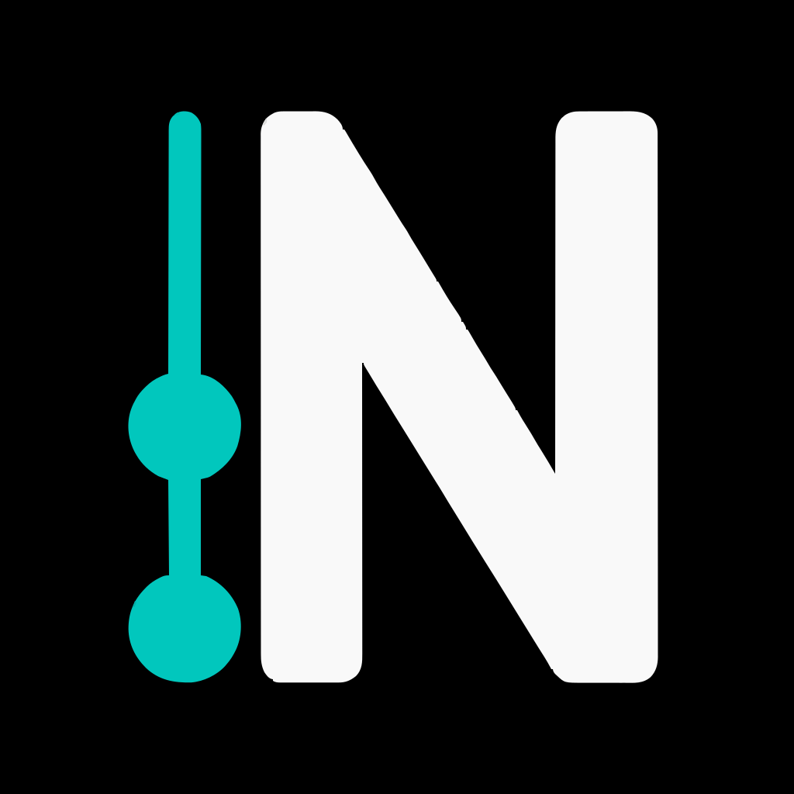
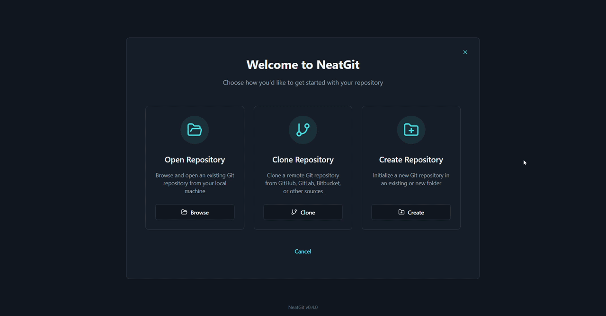

[](https://ko-fi.com/S6S31UJX9J)

# NeatGit 

A modern, beautiful, cross-platform Git client with an emphasize on simplicity, built with Electron, React and TypeScript, available as a native desktop app for Windows and macOS.

## Note ⚠️

NeatGit is currently in early development, and a stable version hasn't been released yet - more features and bug fixes to come soon. Use the app with caution (data loss might occur!), and please report any bug you encounter by opening an issue.

## Features

- Clone repos, open local ones, or create new ones
- Stage, unstage and commit changes
- Pull, push, and fetch changes from remote repos
- Switch, create and delete branches
- Advanced visual diff viewer with full, hunk, and split views
- Stage or unstage individual lines or hunks for precise commits
- Detect renamed files
- Full HTTPS and SSH support for interaction with remote repos
- Work with multiple repos simultaneously
- View commit history of the current branch
- Manage stashes

...all wrapped in a user friendly UI.




## Download & Install

### macOS

1. Download the latest release from the [releases page](https://github.com/lihail/neat-git/releases).
   - **macOS (Apple Silicon: M1/M2/M3, etc.)**: Choose the file ending in `-arm64-mac.dmg`
   - **macOS (Intel)**: Choose the file ending in `-x64-mac.dmg`

2. Open the `.dmg` file and drag NeatGit to your Applications folder.

3. Since NeatGit is not a certified Apple application, macOS will block the app from opening the first time. To resolve this, use one of the following options (you only need to do this once):
   - **Option 1:** Right-click the app → click **Open** → click **Open** in the confirmation dialog.

   - **Option 2:** Run the following command in Terminal:
     ```sh
     xattr -cr /Applications/NeatGit.app
     ```

### Windows

The app was tested on Windows 10 64 bit, and might or might not work on other versions of Windows.

1. Download the latest release from the [releases page](https://github.com/lihail/neat-git/releases). Choose the file ending in `.exe`.

2. Open the `.exe` file and install.

## Local Development

### Requirements

- git
- Node.js

### Getting Started

```sh
git clone https://github.com/lihail/neat-git.git
cd neat-git
npm install
npm start
```

Running `npm start` will open the app in Electron with hot reload enabled, allowing you to see changes instantly as you develop (unless they are in the electron backend, which requires an app restart).

### Electron Backend Debugging

To debug the Electron main process (backend code in `electron`):

1. Set breakpoints in the backend wherever you want.
2. Run `npm start`.
3. In VS Code or Cursor, open the Run and Debug panel, select the "Attach to Electron Backend" configuration, and click the green play button to attach the debugger.

The code should now stop at the breakpoints.

### Creating a Release

1. If the icon was changed (`public/icon.svg`), run the following command. Otherwise, skip this step:

```sh
npm run generate-icons
```

2. Build the app:

```sh
# Build for your current platform
npm run electron:build

# Build for specific platforms
npm run electron:build:mac     # macOS (both Intel and ARM64)
npm run electron:build:win     # Windows
```

The built applications will be available in the `release` directory.

**Note:** Building for a specific platform typically requires running the build **on that platform** (e.g., build macOS apps on a Mac, Windows apps on Windows).

3. Create a git tag (where `<version>` is, for example, v1.0.0):

```sh
git tag <version>
git push origin <version>
```

4. Create a release and upload the built applications in the [releases page](https://github.com/lihail/neat-git/releases).

## Issues & Bugs

Please submit any issue or bug reports on the [issues page](https://github.com/lihail/neat-git/issues).

## License

NeatGit is licensed under the [MIT](https://github.com/lihail/neat-git/blob/main/LICENSE) license.

## Support the Project

NeatGit is completely free and open source. As a way to support development, perks like additional color themes and small bonus features will soon be available for supporters who choose to donate.
